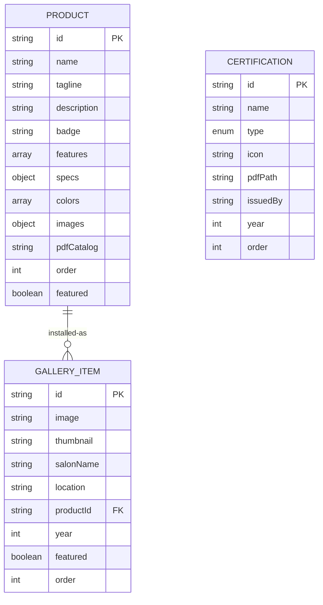

# **4. Database Design (데이터 설계)**
````markdown
# Database Design Document
## VERSPA International Website

**Document Version**: 1.0  
**Last Updated**: 2025-01-08  
**Data Strategy**: Static JSON Files (No Database Server)

---

## 🗂️ Data Architecture Overview

### Approach: File-Based Static Data

**Rationale**:
- Small, predictable dataset (<100 records total)
- Infrequent updates (monthly or less)
- No user-generated content
- Eliminates database hosting costs
- Simplifies deployment and backup (Git version control)

**Trade-offs**:
| Benefit | Limitation |
|---------|------------|
| Zero database costs | No real-time updates without redeployment |
| Simple to maintain | Content updates require Git commit |
| Version controlled | Not suitable for >1000 records |
| Fast read performance | No complex querying capabilities |

---

## 📋 Data Models

### Entity: Product

**File**: `/data/products.json`

**Schema**:
```typescript
interface Product {
  id: string;              // Unique identifier (slug-friendly)
  name: string;            // Display name
  tagline: string;         // Short descriptor
  description: string;     // Long description (1-2 paragraphs)
  badge: string;           // Label (e.g., "NO.1 IN SALES", "NEW TECH")
  features: string[];      // 3-5 key selling points
  specs: {
    dimensions: string;    // e.g., "1900 x 840 x 830 mm"
    weight: string;        // e.g., "66.5 kg"
    voltage: string;       // e.g., "AC 220-240V"
    warranty: string;      // e.g., "3 years"
    massagePoints: number; // e.g., 5
    reclining: string;     // e.g., "Leg Reclining"
  };
  colors: string[];        // Available color options
  images: {
    hero: string;          // Main product image path
    gallery: string[];     // Additional images (3-10)
  };
  pdfCatalog: string;      // Path to downloadable PDF
  order: number;           // Display order on product listing
  featured: boolean;       // Highlight on homepage?
}
```

**Sample Data**:
```json
{
  "products": [
    {
      "id": "verspa-basic",
      "name": "VERSPA BASIC",
      "tagline": "Best of the Best",
      "description": "Our best-selling product designed specifically for head spas, loved by hair salons, beauty care shops, and waxing salons worldwide.",
      "badge": "NO.1 IN SALES",
      "features": [
        "5-Point Massage System",
        "Leg Reclining Function",
        "Optimized for Head Spa"
      ],
      "specs": {
        "dimensions": "1900 x 840 x 830 mm",
        "weight": "66.5 kg",
        "voltage": "AC 220-240V, 50-60Hz",
        "warranty": "3 years",
        "massagePoints": 5,
        "reclining": "Leg Reclining"
      },
      "colors": ["Black", "Desert Brown", "Gray Beige"],
      "images": {
        "hero": "/images/products/basic-hero.jpg",
        "gallery": [
          "/images/products/basic-1.jpg",
          "/images/products/basic-2.jpg",
          "/images/products/basic-3.jpg"
        ]
      },
      "pdfCatalog": "/pdfs/verspa-basic-en.pdf",
      "order": 1,
      "featured": true
    },
    {
      "id": "verspa-zenith",
      "name": "VERSPA ZENITH",
      "tagline": "4th Generation Smart Chair",
      "description": "Revolutionary AI-powered massage system with real-time remote monitoring and rail-based reclining technology.",
      "badge": "NEW TECHNOLOGY",
      "features": [
        "AI Anomaly Detection",
        "Rail Reclining System",
        "Full Touch Screen Control"
      ],
      "specs": {
        "dimensions": "2200 x 850 x 1080 mm",
        "weight": "73 kg (main unit)",
        "voltage": "AC 220-240V, 50-60Hz",
        "warranty": "3 years",
        "massagePoints": 4,
        "reclining": "Main Unit + Leg Reclining"
      },
      "colors": ["Black", "Brown", "Beige"],
      "images": {
        "hero": "/images/products/zenith-hero.jpg",
        "gallery": [
          "/images/products/zenith-1.jpg",
          "/images/products/zenith-2.jpg"
        ]
      },
      "pdfCatalog": "/pdfs/verspa-zenith-en.pdf",
      "order": 2,
      "featured": true
    }
  ]
}
```

**Data Volume**: 4 products (expandable to ~10)

---

### Entity: Gallery Installation

**File**: `/data/gallery.json`

**Schema**:
```typescript
interface GalleryItem {
  id: string;              // Unique identifier
  image: string;           // Image file path
  thumbnail: string;       // Thumbnail (optional, for performance)
  salonName: string | null;// Salon name (if permitted to share)
  location: string;        // City, Country
  productId: string;       // Reference to Product.id
  year: number;            // Installation year
  featured: boolean;       // Show on homepage?
  order: number;           // Display order
}
```

**Sample Data**:
```json
{
  "installations": [
    {
      "id": "salon-paris-01",
      "image": "/images/gallery/paris-01.jpg",
      "thumbnail": "/images/gallery/thumbs/paris-01.jpg",
      "salonName": "Le Coiffeur Premium",
      "location": "Paris, France",
      "productId": "verspa-zenith",
      "year": 2024,
      "featured": true,
      "order": 1
    },
    {
      "id": "salon-la-02",
      "image": "/images/gallery/la-02.jpg",
      "thumbnail": "/images/gallery/thumbs/la-02.jpg",
      "salonName": null,
      "location": "Los Angeles, USA",
      "productId": "verspa-basic",
      "year": 2023,
      "featured": false,
      "order": 5
    }
  ]
}
```

**Data Volume**: 12-50 installations (start with 12, expand over time)

---

### Entity: Certification

**File**: `/data/certifications.json`

**Schema**:
```typescript
interface Certification {
  id: string;              // Unique identifier
  name: string;            // e.g., "KC Certification"
  type: 'certification' | 'patent' | 'award';
  icon: string;            // Icon identifier (for UI rendering)
  pdfPath: string;         // Download link
  issuedBy: string;        // Issuing organization
  year: number;            // Year obtained
  order: number;           // Display order
}
```

**Sample Data**:
```json
{
  "certifications": [
    {
      "id": "kc-cert",
      "name": "KC Certification",
      "type": "certification",
      "icon": "shield",
      "pdfPath": "/pdfs/certificates/kc-cert.pdf",
      "issuedBy": "Korea Testing Laboratory",
      "year": 2019,
      "order": 1
    },
    {
      "id": "ce-cert",
      "name": "CE Certification",
      "type": "certification",
      "icon": "shield",
      "pdfPath": "/pdfs/certificates/ce-cert.pdf",
      "issuedBy": "European Union",
      "year": 2020,
      "order": 2
    },
    {
      "id": "patent-rail-reclining",
      "name": "Rail-Based Reclining System",
      "type": "patent",
      "icon": "award",
      "pdfPath": "/pdfs/patents/rail-system.pdf",
      "issuedBy": "Korean Intellectual Property Office",
      "year": 2022,
      "order": 11
    }
  ]
}
```

**Data Volume**: ~20 certifications + patents

---

## 🔗 Data Relationships


**Relationship Notes**:
- `GALLERY_ITEM.productId` references `PRODUCT.id` (soft foreign key)
- No referential integrity enforced (static data, managed manually)
- Orphaned records possible but easily spotted in code review

---

## 📁 File Structure
````
/data
├── products.json           # Master product catalog
├── gallery.json            # Installation photos metadata
└── certifications.json     # Certificates & patents

/public
├── images/
│   ├── products/
│   │   ├── basic-hero.jpg           (1200x800, <200KB)
│   │   ├── basic-gallery-1.jpg      (1200x800, <200KB)
│   │   ├── zenith-hero.jpg
│   │   └── ...
│   └── gallery/
│       ├── paris-01.jpg             (1600x1000, <300KB)
│       ├── thumbs/
│       │   └── paris-01.jpg         (400x250, <50KB)
│       └── ...
└── pdfs/
    ├── verspa-basic-en.pdf          (<5MB)
    ├── verspa-zenith-en.pdf
    ├── certificates/
    │   ├── kc-cert.pdf
    │   └── ce-cert.pdf
    └── patents/
        └── rail-system.pdf
`````

---

## 🔄 Data Update Workflow

### Process: Content Update
`````mermaid
graph LR
    A[Marketing Team<br/>Wants to Add Product] --> B[Edit products.json<br/>in Local Git Repo]
    B --> C[Add Product Images<br/>to /public/images]
    C --> D[Commit Changes<br/>to Git]
    D --> E[Push to GitHub<br/>main branch]
    E --> F[Vercel Auto-Deploy<br/>~2 minutes]
    F --> G[Changes Live<br/>on Website]
`````

**Step-by-Step for Non-Developers**:
1. Open `data/products.json` in VS Code
2. Copy existing product block
3. Update fields: id, name, description, images, etc.
4. Save file
5. Run `npm run dev` to preview locally
6. Commit to Git: `git add . && git commit -m "Add new product"`
7. Push: `git push origin main`
8. Wait for Vercel deployment notification

---

## 💾 Backup Strategy

**Primary Backup**: Git Version History
- Every change tracked with commit history
- Easy rollback to any previous state

**Secondary Backup**: GitHub Repository
- Cloud-hosted, redundant storage
- Clone to local machine anytime

**Tertiary Backup** (Recommended):
- Weekly automated export to cloud storage (Google Drive/Dropbox)
- Script: `npm run backup` (copies `/data` and `/public` to ZIP)

---

## 🔍 Data Validation

### Validation Rules

**Product Data**:
`````javascript
// Example validation schema (Zod)
const ProductSchema = z.object({
  id: z.string().regex(/^[a-z0-9-]+$/), // Slug format
  name: z.string().min(3).max(50),
  features: z.array(z.string()).min(3).max(5),
  images: z.object({
    hero: z.string().url(),
    gallery: z.array(z.string().url()).min(2)
  }),
  pdfCatalog: z.string().url()
});
`````

**Automated Checks** (CI/CD):
- JSON syntax validation in GitHub Actions
- Schema validation before build
- Broken image path detection
- Dead PDF link checker

---

## 📊 Query Patterns

### Common Data Access Patterns

**1. Get All Products (for Product Listing Page)**:
`````javascript
import products from '@/data/products.json';

const allProducts = products.products
  .sort((a, b) => a.order - b.order);
`````

**2. Get Single Product by ID**:
`````javascript
const product = products.products
  .find(p => p.id === 'verspa-zenith');
`````

**3. Get Featured Gallery Items**:
`````javascript
import gallery from '@/data/gallery.json';

const featuredInstalls = gallery.installations
  .filter(item => item.featured)
  .slice(0, 6);
`````

**4. Get Gallery by Product**:
`````javascript
const zenithInstalls = gallery.installations
  .filter(item => item.productId === 'verspa-zenith');
`````

**Performance Note**: All queries run in-memory at build time (SSG), zero database latency.

---

## 🚨 Data Migration Plan

### If Database Needed in Future (Phase 2+)

**Trigger Conditions**:
- Product catalog exceeds 50 items
- Frequent content updates (daily)
- Need for user-generated content (reviews, etc.)
- Real-time inventory management required

**Migration Path**:
`````
Static JSON → PostgreSQL (Supabase)
`````

**Steps**:
1. Create Supabase project (free tier)
2. Define schema matching JSON structure
3. Write import script: `node scripts/import-to-db.js`
4. Update Next.js to fetch from Supabase API
5. Gradual rollout (A/B test)

**Cost Impact**: Free tier → $25/month (Pro tier)

---

## 🔐 Data Privacy

**Personal Data Stored**: None
- No user accounts
- No cookies tracking
- Contact form data transmitted via email (not stored)

**GDPR Compliance**: Inherently compliant
- No database = no data breach risk
- No data retention policies needed

**Future Consideration**: If analytics added, include cookie consent banner

---

**Document End**

---